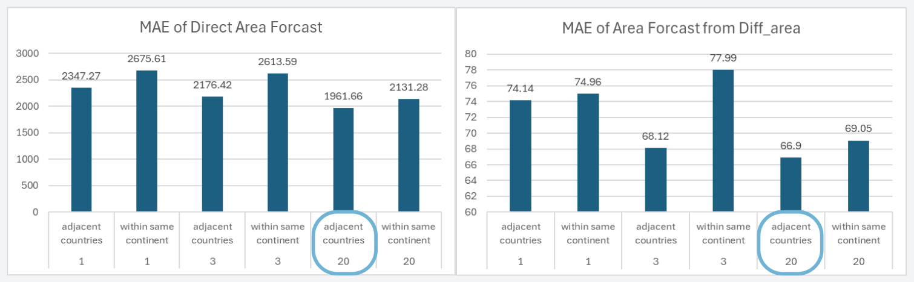

# 🔥 Global Wildfire Forecasting using GNN and LSTM

This project presents a machine learning approach to forecast global wildfires by leveraging the power of Graph Neural Networks (GNN) and Long Short-Term Memory networks (LSTM). 

The objective is to predict the burned area caused by wildfires in each country on a given day using the following datasets:

- 🌐 [Global Fire Burned Area Dataset (Kaggle)](https://www.kaggle.com/datasets/mohammadrahdanmofrad/global-fire-burned-area/data)
- 🌦️ [NOAA Global Summary of the Day (2022) (NOAA)](https://www.ncei.noaa.gov/data/global-summary-of-the-day/access/2022/)
- 📍 [Nominatim Reverse Geocoding API (Nominatim)](https://nominatim.org/release-docs/latest/api/Reverse/)

## Adjacency Definitions

There are two types of adjacency definitions used in this project:

- Countries within the same continent are considered adjacent nodes.

- Geographically neighboring countries are considered adjacent nodes.

## Results

This project is part of the Pattern Recognition (2110573) course (Semester 2/2023) at Chulalongkorn University.